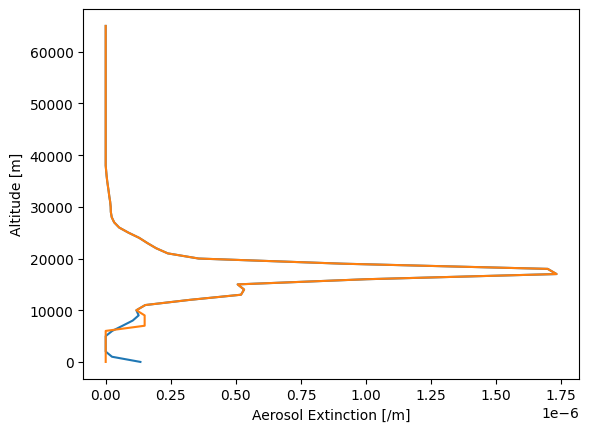
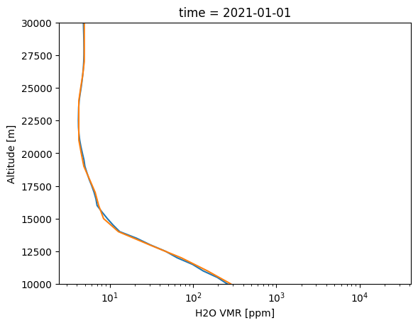

(_quickstart)=
# Quickstart
This guide assumes you have installed the `hawcsimulator` package through `uv`, and have a
terminal currently open to that folder.

## Environment/IDE Setup
Installatino through `uv` will have created a Python virtual environment inside the folder.
If you know what that means and have a Python IDE installed, feel free to use that.  Otherwise
we can use a jupyter notebook for the rest of this guide:

    uv add jupyter
    uv run jupyter notebook

A web browser should have opened up.  Create a new Python3 notebook and open it up.

## ALI Example
A simple ALI retrieval can be performed through,

```{code-block} python
import os
os.environ["OPENBLAS_NUM_THREADS"] = "1"

from hawcsimulator.ali.configurations.ideal_spectrograph import IdealALISimulator

import numpy as np
import pandas as pd
import matplotlib.pyplot as plt

simulator = IdealALISimulator()

input = {
        "tangent_latitude": 30.0,
        "tangent_longitude": 0.0,
        "tangent_solar_zenith_angle": 60.0,
        "tangent_solar_azimuth_angle": 0.0,
        "altitude_grid": np.arange(0, 65001.0, 1000.0),
        "polarization_states": ["I", "dolp"],
        "sample_wavelengths": np.array([470.0, 745.0, 1020.0]),
        "time": pd.Timestamp("2022-01-01T12:00:00Z")
}

data = simulator.run(["l2", "atmosphere"], input, config={"atmosphere_method": "omps_calipso_era5"})

data["l2"]["stratospheric_aerosol_extinction_per_m"].plot(y="altitude")
plt.plot(data["atmosphere"].constituents["aerosol"].extinction_per_m, data["atmosphere"].constituents["aerosol"]._altitudes_m)
plt.xlabel("Aerosol Extinction [/m]")
plt.ylabel("Altitude [m]")
```



## SHOW Example
A simple SHOW retrieval can be performed through,

```{code-block} python
from hawcsimulator.show.configurations.ideal import IdealSHOWSimulator
import pandas as pd
import matplotlib.pyplot as plt

simulator = IdealSHOWSimulator()

input = {
        "tangent_latitude": 30.0,
        "tangent_longitude": 0.0,
        "tangent_solar_zenith_angle": 60.0,
        "tangent_solar_azimuth_angle": 0.0,
        "time": pd.Timestamp("2022-01-01T12:00:00Z"),
        "l2_cfg": {"num_threads": 1}
}

data = simulator.run(["l2", "atmosphere"], input, config={"atmosphere_method": "omps_calipso_era5"})

(data["l2"][0]._ds["h2o_vmr"] * 1e6).plot(y="altitude")
plt.ylim(10000, 30000)
plt.xscale("log")

plt.plot(data["atmosphere"].constituents["h2o"]._vmr*1e6, data["atmosphere"].constituents["h2o"]._altitudes_m, label="H2O")

plt.xlabel("H2O VMR [ppm]")
plt.ylabel("Altitude [m]")

```


## Using Orbital Parameters
Here we load in an example orbit for HAWCsat, and input the measurement parameters to the simulator.
Note that we remove the specification of the solar angles which causes them to be determined automatically
from the measurement time.

```{code-block} python
import sasktran2 as sk

orbital_data = sk.database.StandardDatabase().load_ds("hawcsimulator/geometry/example_orbit.nc")


measurement = orbital_data.isel(across=256, along=750)

input = {
        "tangent_latitude": float(measurement["latitude"]),
        "tangent_longitude": float(measurement["longitude"]),
        "altitude_grid": np.arange(0, 65001.0, 1000.0),
        "polarization_states": ["I", "dolp"],
        "sample_wavelengths": np.array([470.0, 745.0, 1020.0]),
        "time": pd.Timestamp(measurement["time"].values)
}

data = simulator.run(["l2", "atmosphere"], input, config={"atmosphere_method": "omps_calipso_era5"})
```

## Manually specifying the atmospheric state
The previous examples use the option `config={"atmosphere_method": "omps_calipso_era5"}` which loads in atmosphere data
from an example curtain of OMPS-LP stratospheric aerosol extinction, CALIPSO cloud height, and ERA5 water vapour profiles.
Here we run the SHOW simulator where we use the same atmosphere, but we override the water vapour profile,

```{code-block} python
h2o = sk.climatology.mipas.constituent("H2O", sk.optical.HITRANAbsorber("H2O"))

h2o._vmr[20] *= 5
plt.plot(h2o._vmr, h2o._altitudes_m)
plt.xscale("log")

input = {
        "tangent_latitude": 30.0,
        "tangent_longitude": 0.0,
        "tangent_solar_zenith_angle": 60.0,
        "tangent_solar_azimuth_angle": 0.0,
        "time": pd.Timestamp("2022-01-01T12:00:00Z"),
        "constituents": {"h2o": h2o}, # NEW LINE,
        "l2_cfg": {"num_threads": 1}
}

data = simulator.run(["l2", "atmosphere"], input, config={"atmosphere_method": "omps_calipso_era5"})

(data["l2"][0]._ds["h2o_vmr"] * 1e6).plot(y="altitude")
plt.ylim(10000, 30000)
plt.xscale("log")

plt.plot(data["atmosphere"].constituents["h2o"]._vmr*1e6, data["atmosphere"].constituents["h2o"]._altitudes_m, label="H2O")

plt.xlabel("H2O VMR [ppm]")
plt.ylabel("Altitude [m]")
```
